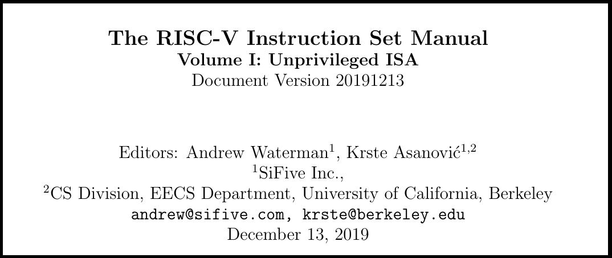
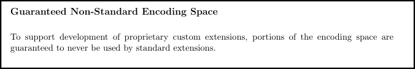
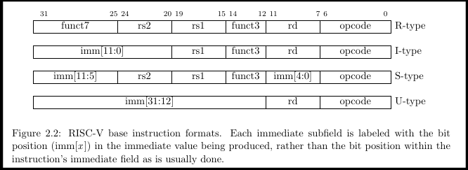
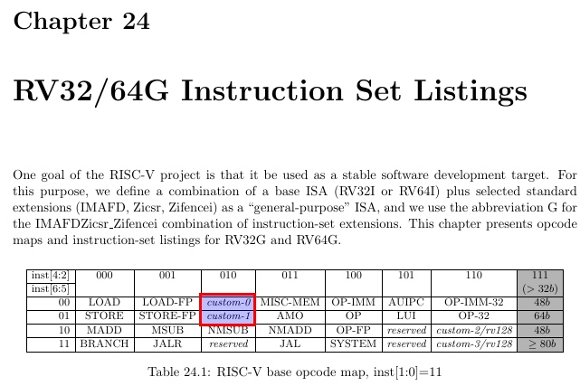
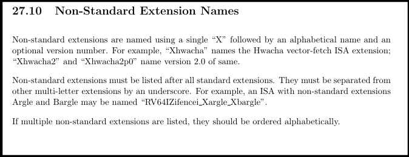
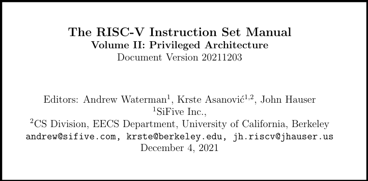
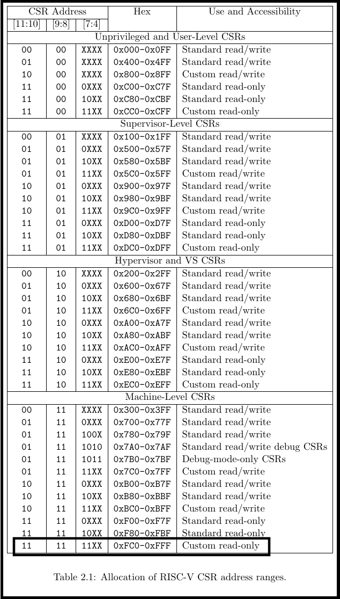

[#add-a-new-extension]
== Example: Add A New Extension and a New CSR

The main purpose of this cookbook,  is to explain how someone can add
an extension (and a CSR) to the RISC-V Sail model. This example attempts
to add a very simple instruction and a very simple CSR to the model.  One
instruction will be added into the custom opcode space.  And that
instruction will be used to manipulate the new CSR,  which can then
be accessed by the existing CSR instructions.

This is an example of what *is*,  not necessarily what it should be.
This follows a pattern from the existing code.

First,  we will walk through the pertinent sections of the RISC-V specifications
to see what the specifications have to say about adding instructions.

Let's start with the Unprivileged Specification



Chapter 26 of the Unpriv Spec ("Extending RISC-V") describes how you can extend
the RISC-V  instruction set.  In this chapter,  we find the following...



This encoding space can be found in chapter 24 in the instruction space listings.
This where you go to find encoding space that has been reserved for custom
extensions.  

You should be familiar with the various types of encodings that RISC-V 
has defined.  These can be found in chapter 2 of the UnPriv Spec.  Here
are the very basic encodings...



Almost certainly you will want to use one of these formats, as all existing
RISC-V instructions use one of these types or their variants.  Now,  having
said all that,  this example is going to do something a bit different. 
For the purposes of this example,  I simply wanted to create a single 
instruction that has the side effect of writing a custom CSR with an immediate
value.  So, when we get to the Sail implementation of the instruction,  you will
see that I created a new type,  and X-type.  [red]#WARNING:  this is not a 
pattern you should follow. This is for educational purposes only.#

Now,  let's figure out what opcode bits you should use.  Go to chapter
24 of the UnPriv Spec.

See unpriv spec, chapter 24, "RV32/64G Instruction Set Listings"



Here we see the opcode bits (bits 6::0) that can be used for a 32-bit opcode.
This is imporatant.  If you stray into other opcode space,  you will almost
certainly end up hurting yourself and creating confusion.

At this point, I should mention that are naming conventions for extensions that
get added to the instructions set. See unpriv spec, chapter 27, 
"ISA Extension Naming Convention", especially
setion 27.10, "Non-Standard Extension Names".  Following is the pertinent 
portion....



For this example,  we are adding a single instruction: xmpl.  The name
for this particular extension will be called "Xxmpl".

Now that we've covered the instruction and its name and its opcode,  let's
move on to the addition of a new CSR.  First, we need to move to the 
Priv Spec.  Why?  Because inherent in the access of the CSR is the 
concept of privilege.  CSRs are typically have some sort of privilege mode
associated with them.  So, go the Priv Spec,  go to chapter 2 and look at 
Table 2.1 (which is reprinted below).  Within this table,  you will see several
regions that are used for custom implementations.




See priv spec, chapter 2, "CSR Listings", Table 2.1



For the purpose of this example,  we are going to use the region
that is marked with a black rectangle.  The CSR will be a custom
read-only CSR that can only be accessed from the machine privilege
level.

So now that we've seen what the specifications say,  let's take a look at
what that means for the Sail model.

Note:  there is a coding style guideline at the top of this github
repository (CODE_STYLE.md).  I have attempted to follow the style in the example.
If you add code to the model,  please make the effort to follow the
coding guidelines.

First, let's be clear what we're going to implement in this example.

Single instruction:  xmpl

CSR: xmpl_csr

* Takes an unsigned immediate and puts the value into the xmpl_csr
* The +xmpl_csr+ can be read by the normal CSR instructions.
* +xmpl_csr+ cannot be written with any form of the CSR instructions; 
it should generate an exception.

As you will see in this example,  adding an instruction is actually 
pretty simple.  It only requires the addition of one file and the modification
of the top level Makefile.  Adding a CSR is actually a bit more complicated;
no new file is needed, but no less than 5 files need to be touched.

Following is the list of files that will be added/touched for this example.
We'll walk through each one of them, one by one.  However,  a lot of the 
code will be obvious.

Files:

* (new) model/riscv_insts_custom_xmpl.sail : the implmentation of the instruction and the CSR.
* (exists) Makefile : must add riscv_insts_xample.sail to the list of source files
* (exists) model/riscv_types.sail : need to add new instruction to the proper instruction opcode grouping.
* (exists) model/riscv_csr_map.sail : the address map of the CSR registers.
* (exists) mpodel/iscv_insts_zicsr.sail : need to add new CSR functionality.
* (exists) model/riscv_csr_map.sail : need to add new CSR name to the mapping
* (exists) model/riscv_sys_control.sail : need to add the new CSR name to the list found in is_CSR_defined().
* (new) cookbook/functional_code_examples/add_a_new_extension/test.S :  for testing the new instruction features

Following is the file that implements the xmpl instruction.  

model/riscv_insts_custom_xmpl.sail:

[source, sail]
----
include::../../../model/riscv_insts_custom_xmpl.sail[]
----

We now need to change the top-level makefile to bring in this new file.

Makefile (around lines 26-37):
```
SAIL_DEFAULT_INST += riscv_insts_zba.sail
SAIL_DEFAULT_INST += riscv_insts_zbb.sail
SAIL_DEFAULT_INST += riscv_insts_zbc.sail
SAIL_DEFAULT_INST += riscv_insts_zbs.sail

SAIL_DEFAULT_INST += riscv_insts_zfh.sail

SAIL_DEFAULT_INST += riscv_insts_zkn.sail
SAIL_DEFAULT_INST += riscv_insts_zks.sail

SAIL_DEFAULT_INST += riscv_insts_zbkb.sail
SAIL_DEFAULT_INST += riscv_insts_zbkx.sail

# Example custom extension (do not include this in the 
#	usual model build.)
SAIL_DEFAULT_INST += riscv_insts_custom_xmpl.sail
```

//model/riscv_types.sail : need to add new instruction to the proper instruction opcode grouping.
//```
//TODO: What changes did I make to this file????
//  Apparently,  I did nothing
//```

The new CSR (actually 2 CSRs;  I was playing around with the
Sail capabilities of mappings, so you will see references to two)
need a mapping from their address to their names.  This is done 
in the following file.

model/riscv_csr_map.sail (around lines 115-120):
```
.
.
mapping clause csr_name_map = 0xF11  <-> "mvendorid"
mapping clause csr_name_map = 0xF12  <-> "marchid"
mapping clause csr_name_map = 0xF13  <-> "mimpid"
mapping clause csr_name_map = 0xF14  <-> "mhartid"
mapping clause csr_name_map = 0xFC0  <-> "xmpl_csr"    // Custom CSR example
mapping clause csr_name_map = 0xFC1  <-> "xmpl_2_csr"    // Custom CSR example
.
.

```

The code that actually does the reads/writes to the CSRs using the 
Zicsr extension instructions is found in the following file.  Note
that only the Read of the CSR is supported,  no writes.  This was done
to check out what happens when you try to write a read-only register.

model/iscv_insts_zicsr.sail (around line 137):
```
.
.
function readCSR csr : csreg -> xlenbits = {
  let res : xlenbits =
  match (csr, sizeof(xlen)) {
    .
    .
    /* machine mode, custom extension example */
    (0xFC0, _)  => xmpl_csr,  // error: Xmpl_csr is not a subtype of bitvector(32, dec)
    (0xFC1, _)  => xmpl_csr_2.bits(),
    .
    .
```

The following file provides a function to see if the CSR is defined.

model/riscv_sys_control.sail (within function +is_CSR_defined()+ ):
```
function is_CSR_defined( csr : csreg, p : Privilege) -> bool = 
.
.
    /* custom CSRs */
    0xFC0 => p == Machine,      // xmpl_csr     Example custom csr
    0xFC1 => p == Machine,      // xmpl_csr_2   Example custom csr
.
.

```
And with that,  we have completed the implementation of the CSR for this
example.   At this point,  you should probably try and compile.  Got to the 
root directory of your repo,  and run...

```
make ARCH=RV32 csim
```

If you've made it this fair,  you need to do a little testing of your new
instruction and your new CSR.  However,  your GNU assembler (or whatever it 
is that you're using) probably has no idea what +xmpl+ is.  So,  how do you
write some assembly code to test out your new instruction?   Let's take
a look at one way to test the new instruction.


cookbook/functional_code_examples/add_a_new_extension/test.S :  for testing the new instruction features

[source, assembler]
----
include::./test.S.line_numbers[]
----


What does the test.dump file look like?   Remember,  the RISC-V assembler knows nothing
about the custom instruction we have added.

cookbook/functional_code_examples/add_a_new_extension/test.dump:
```
    .
    .
    89	80000062 <the_test_begin>:
    90	80000062:	0dead12b          	0xdead12b
    91	80000066:	fc1021f3          	csrr	gp,0xfc1
    .
    .
```

Note that the disassembler has no idea what to do with the opcode, +0x0dead12b+.
So,  it just leaves it as a word at location +0x80000062+.

Now that you've compiled an assembly language program
and gotten a .elf file,  you are now ready to run it against
your model. The executable is found at: +<root>/c_emulator/riscv_sim_RV32+. 
To run the simulation from the example directory,  perform the following...

```
../../../c_emulator/riscv_sim_RV32 test.elf
```

The simulator will send its output to stdout.  You can capture it in the
usual file I/O redirection method.
 

What does the Sail log look like?
```
.
.
   424	model/riscv_step.sail
   425	model/riscv_step.sail:75.25-75.32
   426	entering step() function...
   427	
   428	mem[X,0x80000062] -> 0xD12B
   429	mem[X,0x80000064] -> 0x0DEA
   430	[41] [M]: 0x80000062 (0x0DEAD12B) x.xmpl 1824162
   431	
   432	
   433	model/riscv_step.sail
   434	model/riscv_step.sail:75.25-75.32
   435	entering step() function...
   436	
   437	mem[X,0x80000066] -> 0x21F3
   438	mem[X,0x80000068] -> 0xFC10
   439	[42] [M]: 0x80000066 (0xFC1021F3) csrrs gp, xmpl_2_csr, zero
   440	CSR xmpl_2_csr -> 0x001BD5A2
   441	x3 <- 0x001BD5A2
.
.

```

Note that on line 430,  we see the execution of the custom instruction
and notice that the simlutor knows how to decode the instruction. On line 439,
we see that the normal RISCV instriucion, +csrrs+, can successfully read the
CSR.  Woohoo!

You will probably have to add command line switches to enable/disable extensions/functionality.
Files that need to be touched are:

* (exists) c_emulator/riscv_sim.c : implements the longopts functionality
* (exists) model/riscv_sys_regs.sail : function signatures for sys_enable_XXX() functionms.
* (exists) c_emulator/riscv_platform_impl.* : global variables for holding enabled state vars
* (exists) c_emulator/riscv_platform.c :  implements the C functions that will be made available to Sail;
functions like sys_enable_zfinx().

This is actually a separate topic that requires its own example
and will be added soon.


Other goals:

* Demonstrate the experimental switch
* Demonstrate how to code WARL fields based on settings in the YAML files.


