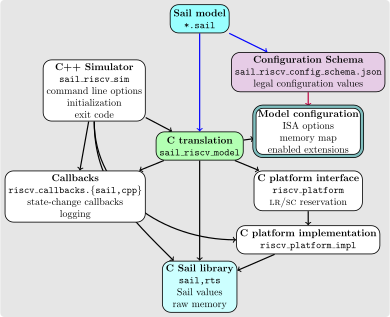

= A guide to reading the Sail RISC-V specification
:toc: left
:toc-title: Contents
:sectanchors:

This RISC-V specification is written in the Sail language. Although
specifications in Sail are quite readable as pseudocode, it would help
to have the [Sail manual](https://alasdair.github.io/manual.html)
handy.

== Structure of the specification

The Sail files in the link:../model/[model] subdirectory have a
modular structure that is best understood by looking at the
link:../model/riscv.sail_project[riscv.sail_project] file.  This file
describes the various modules in the Sail model, the files that
constitute them, and their inter-dependencies.  More information on
Sail modules is present in the
https://alasdair.github.io/manual.html#_modular_sail_specifications[Sail
language manual].

A simplified rendering of this modular structure is shown in

where arrows indicate a dependency relationship.  The
link:../model/riscv.sail_project[riscv.sail_project] file can be
easier to understand than the figure; it is also more authoritative.

TIP: One might need to right-click on the image and open the image in
a new tab or window to see it in more detail.

A Sail module typically consists of a group of closely related Sail
source files, and a declaration of their dependencies on other
modules.  The RISC-V specification consists of a few core modules and
several extension modules.  Within a module, the later files in the
module usually depend on the earlier ones.

The `riscv_core`, `riscv` and `riscv_postlude` modules are the primary
core modules, with most of the other modules being submodules of the
`extensions` module.

=== The `riscv_core` module

This module provide the types and functions that the rest of the
modules depend on.

link:../model/riscv_xlen.sail[riscv_xlen.sail],
link:../model/riscv_flen.sail[riscv_flen.sail] and
link:../model/riscv_vlen.sail[riscv_vlen.sail] define the types and
widths used in the model for the base ISA (e.g. `xlen`,
`physaddr_bits`), the floating point extensions (`flen`) and the
vector extensions (`vlen`) respectively.  These widths are specified
as `config` values, which means their value is derived from the
configuration file for the model.

link:../model/prelude.sail[prelude.sail] contains useful Sail library
functions.  The lowest level memory access primitives are defined in
link:../model/prelude.sail[prelude_mem.sail] and are implemented by
the various Sail backends.
link:../model/prelude_mem_addrtype.sail[prelude_mem_addrtype.sail] and
link:../model/prelude_mem_metadata.sail[prelude_mem_metadata.sail]
contain other low-level definitions related to memory.

link:../model/riscv_extensions.sail[riscv_extensions.sail] sets up the
basic infrastructure for the definition of modules implementing RISC-V
extensions.  The `hartSupports` function determines whether an
extension is supported by the model configuration, while the
`currentlyEnabled` determines whether the extension is usable given
the current dynamic state of the hart.

`rvfi_dii*.sail` implements functionality for
https://github.com/CTSRD-CHERI/TestRIG/blob/master/RVFI-DII.md[RISC-V
Formal Interface - Direct Instruction Injection (RVFI-DII)], allowing
the model to be used with testing tools such as
https://github.com/CTSRD-CHERI/TestRIG[TestRIG].  These files can be
ignored on a first reading.

`riscv_types*.sail` and `riscv_*types.sail` contain important types
that are used in the rest of the specification.
link:../model/riscv_types.sail[riscv_types.sail] contains some basic
RISC-V definitions. This file should be read early since these
definitions are used throughout the specification for privilege
levels, register indices, interrupt and exception definitions and
enumerations, and types used to define memory accesses.

link:../model/riscv_regs.sail[riscv_regs.sail] contains the base
register file, where each register is defined as having the `regtype`
type defined in link:../model/riscv_reg_type.sail[riscv_reg_type.sail]
and indexed by the indices defined in
link:../model/riscv_types.sail[riscv_types.sail].

link:../model/riscv_csr_begin.sail[riscv_csr_begin.sail] sets up the
infrastructure for the scattered definitions of CSRs and their access
for read and write operations.

link:../model/riscv_callbacks.sail[riscv_callback.sail] contains
definitions for callbacks that inform an external harness (such as the
C++ emulator) about state-changing events.

link:../model/riscv_pc_access.sail[riscv_pc_access.sail] defines
functions to access and modify the program counter.

link:../model/riscv_sys_regs.sail[riscv_sys_regs.sail] describes the
privileged architectural state, viz. M-mode and S-mode CSRs, and
contains helpers to interpret their content, such as WLRL and WARL
fields.

link:../model/riscv_addr_checks_common.sail[riscv_addr_checks_common.sail]
and link:../model/riscv_addr_checks.sail[riscv_addr_checks.sail]
contain extension hooks to support the checking and transformation of
memory addresses during the execution of an instruction. The
transformed addresses are used for any address translation; however,
any memory access exceptions are reported in terms of the original
memory address (i.e. the one generated by the instruction, not the
hook).

The floating point arithmetic in the model is implemented by a wrapper
around the Berkeley Softfloat library; this wrapper is implemented in
link:../model/riscv_softfloat_interface.sail[riscv_softfloat_interface.sail]

=== The `riscv_exceptions` and `pmp` modules

The handling of the addresses involved in exception handling are
specified by the functions in
link:../model/riscv_sys_exceptions.sail[riscv_sys_exceptions.sail]
while
link:../model/riscv_sync_exception.sail[riscv_sync_exception.sail]
defines a structure that is used to capture the architectural
information for an exception. These files constitute the
`riscv_exceptions` module.

The `pmp` module implements physical memory protection
(PMP). link:../model/riscv_pmp_regs.sail[riscv_pmp_regs.sail] defines
the PMP registers and their read and write accessors while
link:../model/riscv_pmp_control.sail[riscv_pmp_control.sail]
implements the PMP permission checks and matching priority.

=== The `riscv` module

This core module deals with the hart's reservation state, physical and
virtual memory, the platform memory map, and interrupt and exception
handling.

The reservation state is maintained external to the model and is
accessed through the functions in
link:../model/riscv_sys_reservation.sail[riscv_sys_reservation.sail].

link:../model/riscv_sys_control.sail[riscv_sys_control.sail] describes
interrupt and exception delegation and dispatch, and the handling of
privilege transitions.

link:../model/riscv_platform.sail[riscv_platform.sail] contains
platform-specific functionality for the model. It contains the
definitions for the physical memory map, the cache block size, the
local interrupt controller, and the MMIO interfaces to the clock,
timer and terminal devices.  Sail functions connect to externally
provided (i.e. external to the Sail model) platform functionality,
such as those provided by the platform support in the C++
emulator. This file also contains some of the configurable options
for platform behavior, such as the handling of misaligned memory
accesses, the handling of PTE dirty-bit updates during address
translation, etc.

link:../model/riscv_mem.sail[riscv_mem.sail] contains the functions
that convert accesses to physical addresses into accesses to physical
memory, or MMIO accesses to the devices provided by the platform, or
into the appropriate access fault. This file also contains definitions
that are used in the weak memory concurrency model.

The `riscv_vmem_{types,pte,ptw,tlb}.sail` and
link:../model/riscv_vmem.sail[riscv_vmem.sail] files describe the
S-mode address translation.  More details are in
link:./notes_Virtual_Memory.adoc[Virtual Memory Notes].

link:../model/riscv_vmem_utils.sail[riscv_vmem_utils.sail] provides a
higher level interface to virtual memory for load/store style
instructions that handles address translation and accesses to
misaligned addresses taking platform configuration options into
account.

link:../model/riscv_insts_begin.sail[riscv_insts_begin.sail] sets up
the infrastructure for the definition of instructions in the rest of
the model.  Files matching `riscv_insts_*.sail` capture the
instruction definitions and their assembly language formats. Each file
contains the instructions for an extension. Each instruction is
represented as a variant clause of the `instruction` type, and its
execution semantics are represented as a clause of the `execute`
function. `mapping` clauses specify the encoding and decoding of each
instruction to and from their binary representations and assembly
language formats.

=== The `riscv_postlude` module

This module essentially completes the specification by providing
implementations of the instruction fetcher and the driving function
for the fetch-decode-execute cycle.

link:../model/riscv_insts_end.sail[riscv_insts_end.sail] and
link:../model/riscv_csr_end.sail[riscv_csr_end.sail] terminate the
scattered definitions begun in the `riscv_insts_begin.sail` file in
the `riscv` module and the `riscv_csr_begin.sail` file in the
`riscv_core` module respectively.

Definitions for the instruction stepper are in
link:../model/riscv_step_common.sail[riscv_step_common.sail], while
some hooks to customize the stepper and the instruction decode are in
link:../model/riscv_step_ext.sail[riscv_step_ext.sail] and
link:../model/riscv_decode_ext.sail[riscv_decode_ext.sail]
respectively.  The instruction fetch is implemented in
link:../model/riscv_fetch.sail[riscv_fetch.sail], where the `fetch` is
done in 16-bit granules to handle RVC instructions.

The top-level fetch-decode-execute driver is in
link:../model/riscv_step.sail[riscv_step.sail] The `try_step` function
performs the instruction fetch, handles any fetch errors, decodes the
fetched value, dispatches the execution of the decoded instruction,
checks for any pending interrupts that may need to be handled, and
maintains the current state of the model.  The `try_step` function is
the primary interface to the external C++ simulator harness.

A `loop` function in `riscv_step.sail` implements the standalone
version of the fetch-decode-execute loop, and uses the same HTIF
(host-target interface) mechanism as the Spike emulator to detect
termination of execution.  This function can be used to drive the
model without the use of the C++ simulator.

The configuration for the model is validated in
link:../model/riscv_validate_config.sail[riscv_validate_config.sail].
A device tree and ISA string for the configuration is generated using
functions in
link:../model/riscv_device_tree.sail[riscv_device_tree.sail].
Model initialization and reset are implemented in
link:../model/riscv_model.sail[riscv_model.sail].

`riscv_fetch_rvfi.sail` provides the fetch function when the model
is used for RVFI, and complements the `rvfi_dii*.sail` files mentioned
above.

=== Extensions

The `extensions` module contains a sequence of submodules, each
typically implementing an ISA extension.  In some cases, submodules
implementing related extensions (e.g. `Zaamo` and `Zalrsc`) may be
grouped together and nested within another submodule (e.g. `A`) under
the `extensions` module.  This nested structure helps to organize the
files implementing large related extensions such as those in the
Vector (`V`) and cryptography (`K`) extensions.

=== Other modules

The `riscv_termination` module specifies
link:../model/riscv_termination.sail[functions] that are used to prove
loop termination for theorem prover backends of Sail.  The
`unit_tests` module collects Sail unit tests for the specification.
The `riscv_main` module provides a link:../model/main.sail[`main()`]
function that is used in other Sail backends.

== Structure of the C++ emulator

The diagram below illustrates how the C++ emulator is built from the
Sail model.

The nodes that are not colored are the handwritten files for the C++
emulator. The black arrows indicate dependency relationships, while
the blue arrow indicates a file generated by the Sail compiler from
Sail source files.

link:../c_emulator/riscv_sim.cpp[riscv_sim.cpp] is the top level file
for the emulator: it processes command line options, initializes the
platform model with any ISA implementation choices if specified, and
loads the ELF program or OS image into raw memory, including any ROM
firmware and DeviceTree binary blobs, and initializes the memory map.

The generated C model `sail_riscv_sim` is built from the Sail sources
by the Sail compiler and contains calls to the platform interface
link:../c_emulator/riscv_platform.h[riscv_platform.h] for
platform-specific information; the latter is typically defined as
externally specified in the Sail file `riscv_platform.sail`.

The Sail system provides a C library for use with its C backend, which
provides the low-level details of the implementation of raw memory and
bitvectors (typically optimized to use the native machine word
representation).
