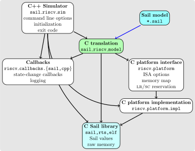

A guide to reading the specification
------------------------------------

> [!WARNING]
> This document is undergoing updates and is not fully up to date
> with the current state of the model. Please refer to the
> [Sail code](../model/) itself for the most up to date information.

The model is written in the Sail language.  Although specifications in
Sail are quite readable as pseudocode, it would help to have the [Sail
manual](https://alasdair.github.io/manual.html) handy.

The Sail modules in the `model` directory have the structure shown
below.  Arrows indicate a dependency relationship, and _italics_
indicate fragments that are not strictly part of the specification,
such as the platform memory map.

- `riscv_xlen32.sail` and `riscv_xlen64.sail` define xlen dependent
  variables (`log2_xlen_bytes` and `physaddrbits_len`) for RV32 and
  RV64.  One of them is chosen during the build using the ARCH variable.

- `prelude_*.sail` contain useful Sail library functions.  These
  files should be referred to as needed.  The lowest level memory
  access primitives are defined in `prelude_mem.sail`, and are
  implemented by the various Sail backends. `prelude_mem.sail`
  depends on the value of `xlen`.

- `riscv_types.sail` contains some basic RISC-V definitions.  This
  file should be read first, since these definitions
  are used throughout the specification, such as privilege levels,
  register indices, interrupt and exception definitions
  and enumerations, and types used to define memory accesses.  The
  register type is separately defined in `riscv_reg_type.sail` so that
  extensions of the model can redefine it if required.

- `riscv_regs.sail` contains the base register file, where each
  register is defined as having the `regtype` type defined in
  `riscv_reg_type.sail` and indexed by the indices defined in
  `riscv_types.sail`.

- `riscv_pc_access.sail` defines functions to access and modify the
  program counter.

- `riscv_sys_regs.sail` describes the privileged architectural state,
  viz. M-mode and S-mode CSRs, and contains helpers to interpret their
  content, such as WLRL and WARL fields.  `riscv_sys_control.sail`
  describes interrupt and exception delegation and dispatch, and the
  handling of privilege transitions. `riscv_sys_exceptions.sail`
  defines the handling of the addresses involved in exception
  handling. `riscv_sync_exception.sail` describes the structure used
  to capture the architectural information for an exception.

  Since WLRL and WARL fields are intended to capture platform-specific
  functionality, future versions of the model might separate their
  handling functions out into a separate platform-defined file.  The
  current implementation of these functions usually implement the same
  behavior as the Spike emulator.

- `riscv_pmp_regs.sail` and `riscv_pmp_control.sail` implement support
  for physical memory protection (PMP).  `riscv_pmp_regs` handle read
  and write access to the PMP registers, while `riscv_pmp_control`
  implements the permission checking and matching priority.

- `riscv_platform.sail` contains platform-specific functionality for
  the model.  It contains the physical memory map, the local interrupt
  controller, and the MMIO interfaces to the clock, timer and terminal
  devices.  Sail `extern` definitions are used to connect externally
  provided (i.e. external to the Sail model) platform functionality,
  such as those provided by the platform support in the C
  emulator.  This file also contains the externally selectable
  options for platform behavior, such as the handling of misaligned
  memory accesses, the handling of PTE dirty-bit updates during
  address translation, etc.  These platform options can be specified
  via command line switches in the C emulator.

- `riscv_mem.sail` contains the functions that convert accesses to
  physical addresses into accesses to physical memory, or MMIO
  accesses to the devices provided by the platform, or into the
  appropriate access fault.  This file also contains definitions that
  are used in the weak memory concurrency model.

- The `riscv_vmem_*.sail` files describe the S-mode address
  translation. See the [Virtual Memory Notes](./notes_Virtual_Memory.adoc)
  for details.

- The `riscv_addr_checks_common.sail` and `riscv_addr_checks.sail`
  contain extension hooks to support the checking and transformation
  of memory addresses during the execution of an instruction.  The
  transformed addresses are used for any address translation; however,
  any memory access exceptions are reported in terms of the original
  memory address (i.e. the one generated by the instruction, not the
  hook).

- Files matching `riscv_insts_*.sail` capture the instruction
  definitions and their assembly language formats.  Each file contains
  the instructions for an extension, with `riscv_insts_base.sail` containing
  the base integer instruction set.  Each instruction is represented
  as a variant clause of the `ast` type, and its execution semantics
  are represented as a clause of the `execute` function. `mapping`
  clauses specify the encoding and decoding of each instruction to and
  from their binary representations and assembly language formats.
  Hint instructions that are not implicitly handled elsewhere are
  explicitly handled in `riscv_insts_hints.sail`.

- `riscv_fetch.sail` contains the instruction fetch function.  It
  supports checking and transformation of the fetch address as
  described above.

- `riscv_step.sail` implements the top-level fetch and execute loop.
  The `fetch` is done in 16-bit granules to handle RVC instructions.
  The `step` function performs the instruction fetch, handles any
  fetch errors, decodes the fetched value, dispatches the execution of
  the decoded instruction, and checks for any pending interrupts that may
  need to be handled.  A `loop` function implements the execute loop,
  and uses the same HTIF (host-target interface) mechanism as the
  Spike emulator to detect termination of execution.

Note that the files above are listed in dependency order, i.e. files
earlier in the order do not depend on later files.

Structure of the C emulator
----------------------------

The diagram below illustrates how the C emulator is built from the
Sail model.

The nodes that are not colored are the handwritten C files for the C
emulator.  The black arrows indicate dependency relationships, while
the red arrow indicates a file generated by the Sail compiler from
Sail source files.

`riscv_sim` is the top level file for the C emulator: it processes
command line options, initializes the platform model with any ISA
implementation choices if specified, and loads the ELF program or OS
image into raw memory, including any ROM firmware such as the Berkeley
boot loader and DeviceTree binary blobs, and initializes the memory
map.

The generated C model `riscv_sim_$ARCH` is built from the Sail
sources by the Sail compiler for the specified architecture $ARCH,
either RV32 or RV64.  It contains calls to the platform interface
`riscv_platform` for platform-specific information; the latter is
typically defined as externally specified in the Sail file
`riscv_platform.sail`.

The Sail system provides a C library for use with its C backend, which
provides the low-level details of the implementation of raw memory and
bitvectors (typically optimized to use the native machine word
representation).
