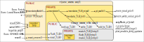

# Notes on the implementation of virtual memory

[riscv_vmem_types.sail](../model/riscv_vmem_types.sail) contains type
definitions for the core types used in the virtual memory
specification. The primary vmem specification code is in
[riscv_vmem.sail](../model/riscv_vmem.sail).
[riscv_vmem_pte.sail](../model/riscv_vmem_pte.sail) describes page
table entries, processing them for validity and permissions checks,
and their updates. [riscv_vmem_ptw.sail](../model/riscv_vmem_ptw.sail)
describes page table walk exceptions.

[riscv_vmem_tlb.sail](../model/riscv_vmem_tlb.sail) implements a
simple TLB (Translation Look-Aside Buffer). Although TLBs are not
specified by RISC-V architecture, it is useful to model at least a
minimal TLB so that we can demonstrate and test `SFENCE.VMA`
functionality (without TLBs, `SFENCE.VMA` is a no-op and there's
nothing to test).

TLBs are also useful for simulation speed. Without a TLB, every Fetch
and Load/Store/AMO in virtual memory mode requires a full page table
walk. Speed matters mostly for large simulations (e.g., Linux-boot
can speed up from tens of minutes to a few minutes).

The main code in [riscv_vmem.sail](../model/riscv_vmem.sail) is
structured and commented to make it is easy to ignore/skip TLB-related
parts.

## Simplified call graph

The following figure shows a rough call graph, and this can serve as a
guide for understanding the code.

The yellow rectangle(s) represent the code in
[riscv_vmem.sail](../model/riscv_vmem.sail), and the grey rectangle(s)
represent the code in
[riscv_vmem_tlb.sail](../model/riscv_vmem_tlb.sail). In each case,
the lighter outer rectangle shows the publicly visible API, and the
darker inner rectangle shows internal (private) resources.

On the left are shown the external places from which the virtual
memory code is invoked, using its public API. On the right are shown
the external resources used by the vmem code.

The main flow (ignoring TLBs) is at the top: The external execution
code for instruction fetch, load, store and AMO invoke
`translateAddr()` and receive a result of `TR_Result` type.
`translateAddr()`, in turn, invokes `translate()`,
`translate_TLB_miss()` and `pt_walk()`; the latter invokes the
`mem_read_priv()` (from [riscv_mem.sail](../model/riscv_mem.sail)) to
read PTEs (Page Table Entries) from memory. The `SATP` register lives
in [riscv_vmem.sail](../model/riscv_vmem.sail) and is accessed by the
general `readCSR()` and `writeCSR()` functions.

`translate()` invokes `lookup_TLB()` and, if a hit, invokes
`translate_TLB_hit()`, avoiding a page-table walk (and therefore no
reads from memory).

`mem_write_value_priv()` (from
[riscv_mem.sail](../model/riscv_mem.sail)) is called for writing back,
to memory, PTEs (Page Table Entries) whose A and/or D bits have been
modified as part of the access.
