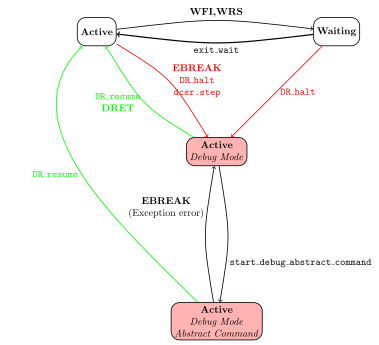

This is a brief description of the hart states involved in the
implementation of the `Sdext` extension.

Under normal (non-Debug mode) operation, the `hart_state` is either
`Active` or `Waiting`.  The `Waiting` state is entered by the `WFI`
and `WRS.{NTO,STO}` instructions, and exited due to reasons such as
incoming interrupts or reservations becoming invalid.

Debug Mode creates two additional states for the hart that are
variants of the `Active` state.  The `Active (Debug Mode)` state is
entered from the Active state either by executing an `EBREAK`, after
executing an instruction in single-step mode (i.e. `dcsr[Step]` is
set), or being requested to halt (`DR_halt`) by the external harness
driving the model.  If the halt request is made when the hart is
`Waiting`, the hart completes the execution of the waiting instruction
and enters the `Active (Debug Mode)` state.

When in `Active (Debug Mode)`, the debugger might request the
execution of abstract commands (which may include the execution of
instructions from a debug program buffer).  The hart enters the
`Active (Debug Mode Abstract Command)` state to perform this
execution.  This state is left either by executing an `EBREAK` or
encountering an exception during execution; in both cases, the hart
transitions back to `Active (Debug Mode)`.  An error condition is set
in the latter exception case; this should be checked (and then
cleared) by the external harness.

The external harness can also request the model to exit the Debug mode
states and re-enter `Active` with `DR_resume`.

The `DR_halt` and `DR_resume` requests to the model are made using
arguments to the `try_step()` function that serves as the primary
interface between the model and external harness.
