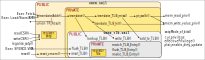

= Notes on the Virtual Memory part Sail RISC-V Spec

NOTE: this is an AsciiDoc document and can be processed into
      browser-readable HTML by the free, open-source tool
      `asciidoctor`.

NOTE: If you are a code maintainer, kindly update this document if
      there are any significant developements in vmem code.

This is a commentary/reader's guide to the virtual memory ("vmem")
code in the Sail RISC-V Formal Spec ("Golden Model").  The primary
vmem specification code is in file:

    model/riscv_vmem.sail

Additional files:

    model/riscv_vmem_common.sail
    model/riscv_vmem_pte.sail
    model/riscv_vmem_ptw.sail
    model/riscv_vmem_tlb.sail
    model/riscv_vmem_types.sail

`riscv_vmem_common.sail` contains the parameterization for Sv32, Sv39,
Sv48 and Sv57.

`riscv_vmem_pte.sail` describes Page Table Entries, checks for
permission bits, etc.

`riscv_vmem_ptw.sail` describes Page Table Walk exceptions.

`riscv_vmem_tlb.sail` implements a simple TLB (Translation Look-Aside
Buffer).  TLBs are not part of the RISC-V architecture spec.
Nevertheless, it is useful to model at least a minimal TLB so that we
can demonstrate and test SFENCE.VMA functionality (without TLBs,
SFENCE.VMA is a no-op and there's nothing to test).

TLBs are also useful for sail-riscv model simulation speed.  Without a
TLB, every Fetch and Load/Store/AMO in virtual memory mode requires a
full page table walk.  Speed matters mostly for large simulations
(e.g., Linux-boot can speed up from tens of minutes to a few minutes).

The main vmem code in `riscv_vmem.sail` is structured and commented to
make it is easy to ignore/skip TLB-related parts.

`riscv_vmem_types.sail` concerns non-standard extensions to the vmem
system and can be ignored (it is used, e.g., by U.Cambridge's CHERI
system).

// SECTION ================================================================
== Simplified call graph

The following figure shows a rough call graph, and this can serve as a
guide for understanding the code.

The yellow rectangle(s) represent the code in `riscv_vmem.sail`, and
the grey rectangle(s) represent the code in `riscv_vmem_tlb.sail`.  In
each case, the lighter outer rectangle shows the publicly visible
resources ("API"), and the darker inner rectangle shows internal
(private) resources.

On the left are shown the external places from which the vmem code is
invoked, using its public resources.  On the right are shown the
external resources used by the vmem code.

The main flow (ignoring TLBs) is at the top: The external execution
code for instruction fetch, load, store and AMO invoke
`translateAddr()` and receive a result of `TR_Result` type.
`translateAddr()`, in turn, invokes `translate()`,
`translate_TLB_miss()` and `pt_walk()`; the latter invokes the
external `mem_read_priv()` to read PTEs (Page Table Entries) from
memory.  The SATP register lives in this vmem code, and is accessed by
the external general `readCSR()` and `writeCSR()` functions.

`translate()` invokes `lookup_TLB()` and, if a hit, invokes
`translate_TLB_hit()`, avoiding a page-table walk (and therefore no
reads from memory).

`mem_write_value_priv()` is called for writing back, to memory, PTEs
(Page Table Entries) whose A and/or D bits have been modified as part
of the access.

// SECTION ================================================================
== Status

* 2024-02-18: Many stylistic updates based on PR comments.

* 2023-11-30: Passing all ISA tests in `tests/riscv-tests` (163 for
  RV32 and 229 for RV64, about half of which run with Virtual Memory).
  Also passing 712 tests in GitHub CI flow.

* 2023-11-30: Sv57 not yet implemented (the code has placeholders
  for Sv57 support; search for "Sv57")

* 2023-11-30: Sv48 or Sv57 have not been tested; we do not have any tests for them.

// SECTION ================================================================
== Diary notes

2019: Original code written, primarily by https://github.com/pmundkur[@pmundkur]

2023-11: Refactored by https://github.com/rsnikhil[@rsnikhil] for:

* Unifying previously separate RV32/RV64, Sv32/Sv39/Sv57 code into a
  single, parameterized code.
* Misc. stylistic improvements.
* Deleted older files:
+
    riscv_pte.sail
    riscv_ptw.sail
    riscv_vmem_common.sail
    riscv_vmem_rv32.sail
    riscv_vmem_rv64.sail
    riscv_vmem_sv32.sail
    riscv_vmem_sv39.sail
    riscv_vmem_sv48.sail
+
